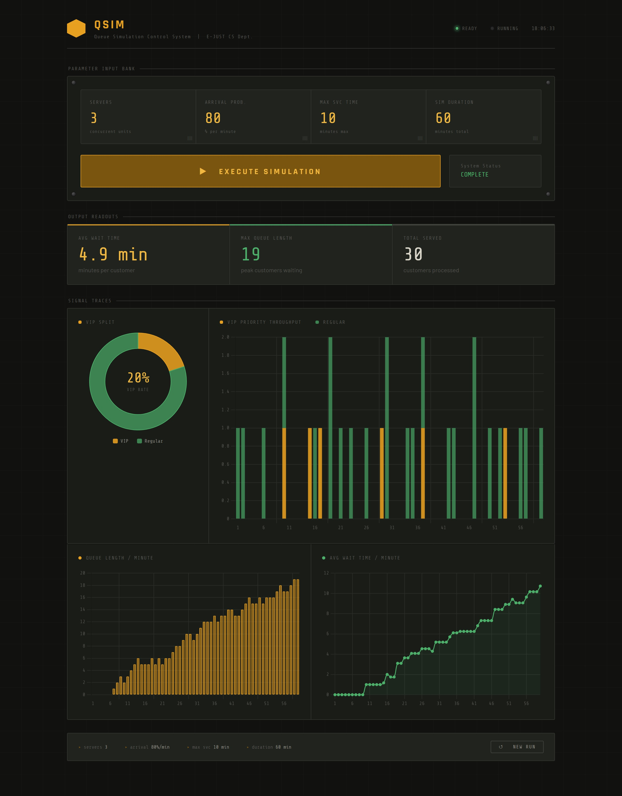
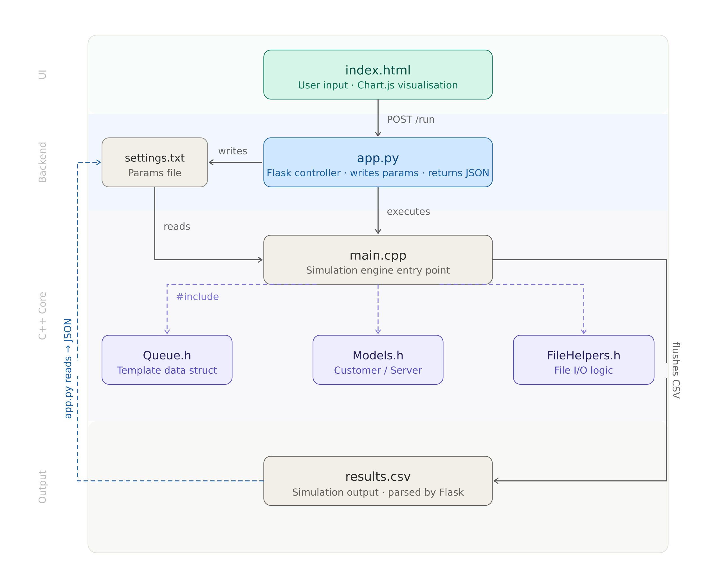

# Queue Simulation — Multi-Server Discrete-Event Simulator

An event queueing simulation built with a **C++ engine at its core** and a **Python/Flask web interface**. Users can configure server count and arrival rate through a browser, run the simulation, and instantly visualize the results via interactive charts.

---
### preview
.
---

### System architecture



---

## Prerequisites

Before running the project, make sure you have the following installed:

- **C++ Compiler** — GCC / MinGW (must support C++11 or higher)
- **Python 3.7+**
- **Flask** — installed via pip

---

## Installation & Setup

### 1. Clone or extract the project files

Place all project files in the same directory. Your folder should look like this:

```
project/
├── main.cpp
├── Queue.h
├── Models.h
├── FileHelpers.h
├── app.py
├── templates/
│   └── index.html
└── results.csv        ← auto-generated after first run
```

### 2. Compile the C++ engine

Open a terminal in the project folder and run:

```bash
g++ main.cpp -o simulation
```

> On Windows this produces `simulation.exe`. On Linux/macOS it produces `simulation`.  
> The Flask app will call this binary automatically — **do not skip this step**.

### 3. Install Python dependencies

```bash
pip install flask
```

---

## How to Run

### 1. Start the Flask server

```bash
python app.py
```

### 2. Open the browser

Navigate to:

```
http://127.0.0.1:5000
```

### 3. Run a simulation

- Set your desired **number of servers** and **arrival rate**
- Click **"Run Simulation"**
- Results will render as charts on the page

---

## File Structure

| File | Role |
|---|---|
| `main.cpp` | C++ simulation engine entry point |
| `Queue.h` | Custom template-based queue data structure |
| `Models.h` | Customer and Server class definitions |
| `FileHelpers.h` | File I/O logic (reads settings, writes results) |
| `app.py` | Flask web server — bridges browser and C++ engine |
| `templates/index.html` | Frontend UI with Chart.js visualisation |
| `settings.txt` | Auto-generated params file written by Flask |
| `results.csv` | Auto-generated simulation output parsed by Flask |

---

## How It Works

1. User submits parameters via the browser
2. Flask writes them to `settings.txt` and executes the compiled C++ binary
3. The C++ engine reads `settings.txt`, runs the simulation, and flushes results to `results.csv`
4. Flask reads `results.csv`, converts it to JSON, and returns it to the browser
5. Chart.js renders the results as interactive graphs

---

## Notes

- Make sure `simulation` (or `simulation.exe` on Windows) is in the **same directory** as `app.py`
- `results.csv` and `settings.txt` are auto-generated — you do not need to create them manually
- If you rename the compiled binary, update the corresponding call in `app.py`
